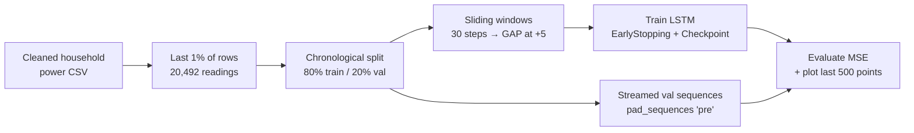

<div align="center">

# LSTM Forecasting of Household Power for IoT

**Stacked LSTM networks that predict Global Active Power 5 minutes ahead on simulated streaming smart-meter data, benchmarked against a streaming linear-regression baseline.**


</div>

## Overview

This graduate course lab was completed for **AAI-530 (IoT)** in the M.S. in Applied Artificial Intelligence program at the University of San Diego. It is the third of three labs on the same smart-meter dataset:

1. [Cleaning & EDA](https://github.com/oxayavongsa/aai-iot-cleaning-and-eda)
2. [Streaming linear regression](https://github.com/oxayavongsa/aai-iot-linear-regression)
3. **LSTM forecasting** (this repo)

An LSTM is trained offline on a historical window. It is then evaluated on a held-out window replayed as a stream: predictions start after only two readings, and short histories are left-padded. A small baseline network is built first, then redesigned and tuned.

## Key results

The final run is [`LSTM_Regression_Assignment_Complete_Rev2.ipynb`](LSTM_Regression_Assignment_Complete_Rev2.ipynb). The target is GAP at t + 5 min, and validation uses 4,092 streamed sequences.

| Model | Architecture | Params | Optimizer | Val. MSE |
|---|---|---|---|---|
| Baseline | LSTM(5) → LSTM(3) → Dense(1), dropout 0.2 | 252 | Adam, lr 0.01 | **0.2030** |
| Optimized | LSTM(64) → LSTM(32) → LSTM(16), BatchNorm + dropout 0.2 after each → Dense(1) | 32,913 | Adam, lr 0.0005 | **0.1915** |

- The optimized network cut validation MSE by about **5.7%** relative to the baseline. Early stopping triggered at epoch 31 for the baseline and epoch 85 for the optimized model.
- The earlier submission ([`LSTM_Regression_Assignment_Complete.ipynb`](LSTM_Regression_Assignment_Complete.ipynb)) is kept for transparency. Its baseline scored MSE 0.7797, and a 60-step / RMSprop variant scored 0.8385, which was *worse*. That result prompted the Rev2 redesign.
- **LSTM vs. linear regression:** the streaming linear-regression lab reached MSE 0.5988 (raw target, μ = 0.9). The two labs evaluate on different slices of the data, so treat the comparison as directional. The write-up recommends a hybrid design: linear regression on the edge device for low-latency predictions, and an LSTM in the cloud for periodic recalibration.

## Approach



- **Leakage-aware split:** chronological, with 16,393 train and 4,099 validation rows and no shuffling.
- **Windows:** 16,358 training sequences of shape `(30, 1)`, checked with `assert` statements.
- **Streaming simulation:** validation inputs grow from 2 readings and are pre-padded with `pad_sequences`.
- **Training:** MSE loss, linear output, `EarlyStopping`, `ModelCheckpoint(save_best_only=True)`.

## Dataset

The data is the [UCI Individual Household Electric Power Consumption](https://archive.ics.uci.edu/ml/datasets/Individual+household+electric+power+consumption) dataset in its cleaned form (2,049,280 one-minute rows). The cleaned CSV is not stored in this repo. It ships as `household_power_clean.zip` in the [linear-regression repo](https://github.com/oxayavongsa/aai-iot-linear-regression).

## Tech stack

Python 3.12 · TensorFlow / Keras · scikit-learn metrics · pandas · NumPy · Matplotlib · Google Colab

## Repository structure

| File | Description |
|---|---|
| [`LSTM_Regression_Assignment_Complete_Rev2.ipynb`](LSTM_Regression_Assignment_Complete_Rev2.ipynb) | **Final** notebook: baseline + optimized model, plots and analysis |
| [`LSTM_Regression_Assignment_Complete.ipynb`](LSTM_Regression_Assignment_Complete.ipynb) | Earlier completed run (60-step / RMSprop variant) |
| [`LSTM Regression Assignment.ipynb`](LSTM%20Regression%20Assignment.ipynb) | Original assignment template (not executed) |
| `README.md` | This file |

## How to run

```bash
git clone https://github.com/oxayavongsa/aai-iot-lstm.git
cd aai-iot-lstm
# get household_power_clean.csv from the aai-iot-linear-regression repo (unzip household_power_clean.zip)
pip install tensorflow pandas numpy scikit-learn matplotlib jupyter
jupyter notebook LSTM_Regression_Assignment_Complete_Rev2.ipynb
```

The notebook was written for Google Colab. When you run it locally, skip the `drive.mount(...)` cell and point `pd.read_csv(...)` at your local `household_power_clean.csv`. Training runs fine on CPU because only 1% of the data is used.

> **Note:** in the optimized Rev2 model, `seq_length` is set to 40, but the training windows are still the 30-step arrays and validation is padded to 50. Keras LSTMs accept variable-length input, so the model runs. A cleaner experiment would rebuild the windows with one consistent length.

## Acknowledgments

The assignment template was provided by the course instructor ([amarbut/aai-iot-lstm](https://github.com/amarbut/aai-iot-lstm)). The data comes from the UCI ML Repository.

---

<div align="center">

**Outhai (Thai) Xayavongsa** · M.S. Applied Artificial Intelligence (University of San Diego) · MBA

[GitHub](https://github.com/oxayavongsa) · [Portfolio](https://oxayavongsa.github.io/ai-automation-portfolio/)

</div>
